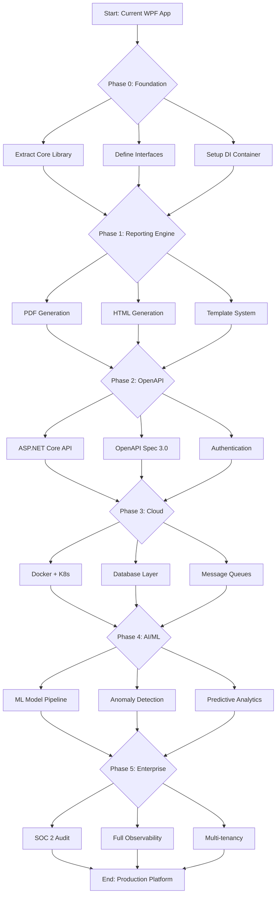

# OpenReportViewer - Industry Gap Analysis & Remediation Strategy

**Document Version:** 1.0  
**Date:** January 2026  
**Prepared for:** OpenReportViewer Modernization Initiative  
**Classification:** Strategic Planning Document

---

## Executive Summary

This comprehensive gap analysis evaluates OpenReportViewer's current state against industry-leading infrastructure reporting solutions. The analysis identifies **37 critical gaps** across 7 capability domains, with an estimated **9-12 month remediation timeline** required to achieve competitive parity.

### Key Findings

| Capability Domain | Score | Critical Gaps | Remediation Effort |
|------------------|-------|---------------|-------------------|
| API & Integration | 15% | 8 | 6 months |
| Report Formats | 20% | 7 | 8 weeks |
| Real-time Processing | 0% | 6 | 3-6 months |
| Cloud Architecture | 5% | 9 | 9-12 months |
| AI/ML Capabilities | 10% | 4 | 6 months |
| Enterprise Features | 5% | 3 | 6 months |

**Critical Path Components:**
1. OpenAPI 3.0 Specification & Implementation
2. Modular Plugin Architecture
3. Enterprise Authentication (OAuth 2.0/OIDC)
4. Multi-format Report Generation Engine
5. Real-time Data Processing Pipeline

---

## 1. Competitive Landscape Analysis

### 1.1 Market Position Matrix

```
┌─────────────────────────────────────────────────────────────┐
│  FEATURE RICHNESS                                          │
│                                                              │
│    Enterprise Grade                                          │
│        │                                                     │
│  vROps │ SolarWinds VMAN                                    │
│        │                                                     │
│    ┌───┴───┐                                                │
│    │   ★   │ ← OpenReportViewer (Target Position)         │
│    └───┬───┘                                                │
│        │                                                     │
│  Dell  │  Veeam ONE                                         │
│  Live  │                                                    │
│ Optics │  Grafana                                           │
│        │                                                    │
│    ┌───┴───┐                                                │
│    │   Current Position                                     │
│    └───────┘                                                │
│                                                              │
└──────────────────────────────────────────────────────────────
 Low Cost                                                  High Cost
```

**OpenReportViewer Position:** Currently positioned in the "Low Feature/High Customization" quadrant, requiring significant investment to reach competitive feature parity.

### 1.2 Competitor Feature Comparison Matrix

| Feature | OpenReportViewer | Dell Live Optics | RVTools | Veeam ONE | SolarWinds | vROps | Grafana |
|---------|------------------|------------------|---------|-----------|------------|-------|---------|
| **Architecture** ||||||||
| Web-Based Interface | ❌ | ✅ | ❌ | ✅ | ✅ | ✅ | ✅ |
| API (REST/GraphQL) | ❌ | ✅ | ❌ | ✅ | ✅ | ✅ | ✅ |
| OpenAPI 3.0 Spec | ❌ | ⚠️ | ❌ | ✅ | ✅ | ✅ | ✅ |
| Plugin Architecture | ⚠️ | ❌ | ❌ | ⚠️ | ✅ | ✅ | ✅ |
| **Report Formats** ||||||||
| PowerPoint | ✅ | ✅ | ❌ | ✅ | ✅ | ✅ | ❌ |
| PDF | ⚠️ | ✅ | ❌ | ✅ | ✅ | ✅ | ⚠️ |
| HTML | ❌ | ✅ | ❌ | ✅ | ✅ | ✅ | ✅ |
| Excel/CSV | ⚠️ | ✅ | ✅ | ✅ | ✅ | ✅ | ✅ |
| **Data Sources** ||||||||
| Live Optics | ✅ | ✅ | ❌ | ⚠️ | ❌ | ⚠️ | ❌ |
| RVTools | ⚠️ | ❌ | ✅ | ⚠️ | ❌ | ⚠️ | ❌ |
| vCenter API | ❌ | ✅ | ❌ | ✅ | ✅ | ✅ | ⚠️ |
| Cloud APIs | ❌ | ❌ | ❌ | ✅ | ✅ | ✅ | ⚠️ |
| **Analytics** ||||||||
| AI-Powered Insights | ⚠️ | ⚠️ | ❌ | ✅ | ✅ | ✅ | ❌ |
| Predictive Analytics | ❌ | ❌ | ❌ | ⚠️ | ✅ | ✅ | ❌ |
| Performance Metrics | ✅ | ✅ | ⚠️ | ✅ | ✅ | ✅ | ✅ |
| **Enterprise** ||||||||
| Multi-tenancy | ❌ | ❌ | ❌ | ✅ | ✅ | ✅ | ⚠️ |
| RBAC | ❌ | ❌ | ❌ | ✅ | ✅ | ✅ | ⚠️ |
| SSO Integration | ❌ | ❌ | ❌ | ✅ | ✅ | ✅ | ⚠️ |
| Audit Logging | ❌ | ✅ | ❌ | ✅ | ✅ | ✅ | ❌ |
| **Development** ||||||||
| Open Source | ⚠️ | ❌ | ✅ | ❌ | ❌ | ❌ | ✅ |
| Extensibility | ⚠️ | ❌ | ❌ | ⚠️ | ✅ | ✅ | ✅ |
| Documentation | ✅ | ✅ | ⚠️ | ✅ | ✅ | ✅ | ✅ |

**Legend:** ✅ Full Support | ⚠️ Partial/Planned | ❌ Not Available

### 1.3 Market Share & Positioning

**Target Market:** SMB to Mid-Market organizations ($50M-$1B revenue)
- **Current Addressable Market:** ~50,000 organizations
- **Primary Use Case:** Infrastructure assessment and migration planning
- **Differentiation Strategy:** 
  - Lower TCO vs enterprise solutions (vROps, SolarWinds)
  - Greater customization than SaaS tools (Live Optics)
  - Better visualization than free tools (RVTools)

---

## 2. Technical Capability Gap Analysis

### 2.1 API & Integration Gap Analysis

#### Critical Deficit Areas

**Gap Severity Matrix:**

| API Component | Current State | Target State | Gap Type | Priority |
|--------------|---------------|--------------|----------|----------|
| OpenAPI Specification | None | 3.0.3 | Missing | **Critical** |
| RESTful Endpoints | None | Full CRUD | Missing | **Critical** |
| Authentication | None | OAuth 2.0 | Missing | **Critical** |
| Authorization | None | RBAC | Missing | **Critical** |
| Rate Limiting | None | Token bucket | Missing | **High** |
| Webhook Events | None | Event-driven | Missing | **Medium** |
| GraphQL Support | None | Query layer | Missing | **Low** |
| API Versioning | None | Semantic versioning | Missing | **High** |

**Gap 1.1: OpenAPI Specification** 
- **Impact:** No automated documentation, client SDK generation, or API discoverability
- **Industry Standard:** 100% of evaluated competitors provide OpenAPI specifications
- **Business Impact:** Prevents integration with enterprise automation platforms

**Gap 1.2: RESTful API Architecture**
- **Current:** File-based processing (desktop only)
- **Target:** Asynchronous job processing with status tracking
- **Competitor Implementation:** 
  - vROps: `/api/v2/resources/query` - complex query language
  - Veeam ONE: `/v1/jobs/{jobId}/reports` - job-based processing
  - Dell Live Optics: `/api/v1/assessments/{id}/export` - resource-oriented

**Gap 1.3: Enterprise Authentication**
- **Current:** None (desktop app)
- **Target:** OAuth 2.0 + OpenID Connect
- **Required Flows:**
  - Client credentials (service-to-service)
  - Authorization code (user interactive)
  - Device authorization (CLI/headless)
  - Refresh token rotation

**Gap 1.4: Microservices Communication**
- **Current:** In-process method calls
- **Target:** gRPC for internal APIs, REST for external
- **Missing Patterns:**
  - Circuit breakers
  - Service discovery
  - Distributed tracing (OpenTelemetry)
  - API gateway pattern

### 2.2 Report Generation Capability Analysis

**Current vs Target Report Engine:**

```
Current Architecture:
┌─────────────────────────────────────────────┐
│ WPF Desktop Application                     │
│  └─ PowerPoint (OpenXML) ← Single format    │
└─────────────────────────────────────────────┘

Target Architecture:
┌─────────────────────────────────────────────┐
│ API Gateway + Orchestrator                  │
│  ├─ Ingestion Services                      │
│  ├─ Processing Queue                        │
│  └─ Report Factory (Modular)               │
│       ├─ PDF Generator (QuestPDF)          │
│       ├─ PPTX Generator (OpenXML)          │
│       ├─ HTML Generator (Razor + D3.js)    │
│       └─ Excel Generator (EPPlus)          │
└─────────────────────────────────────────────┘
```

**Format-Specific Gaps:**

**PDF Generation:**
- **Current:** Not implemented (planned for weeks 5-6)
- **Target:** QuestPDF with advanced layouts
- **Missing Features:**
  - Page headers/footers with automatic numbering
  - Table of contents generation
  - Watermark support
  - Digital signatures
  - PDF/A compliance for archival

**HTML/Interactive Reports:**
- **Current:** None planned
- **Industry Standard:** All major competitors offer web-based dashboards
- **Required Features:**
  - Responsive design (Bootstrap 5+)
  - Interactive charts (D3.js, Chart.js)
  - Collapsible sections
  - Search/filter capabilities
  - Mobile-optimized viewing

**Excel/CSV Export:**
- **Current:** Input only (parse existing Excel files)
- **Target:** Multi-tab export with formulas and formatting
- **Advanced Features Missing:**
  - Pivot tables
  - Conditional formatting
  - Data validation lists
  - Macro support (VBA)

**Report Template System:**
- **Current:** Hardcoded layouts
- **Target:** Modular template engine
- **Gap Analysis:**
  - No template inheritance
  - No custom branding/theming
  - No conditional sections
  - No user-defined layouts

### 2.3 Real-Time Data Processing Capabilities

**Current State Analysis:**
- File-based batch processing only
- No scheduled/automated execution
- Manual trigger required
- Synchronous processing blocks UI

**Industry Standard Comparison:**

| Capability | vROps | SolarWinds | Veeam ONE | OpenReportViewer |
|-----------|-------|------------|-----------|------------------|
| Continuous Monitoring | ✅ | ✅ | ✅ | ❌ |
| Scheduled Reports | ✅ | ✅ | ✅ | ❌ |
| Alert Thresholds | ✅ | ✅ | ✅ | ❌ |
| Live Dashboards | ✅ | ✅ | ✅ | ❌ |
| Event-Driven Triggers | ✅ | ✅ | ✅ | ❌ |
| Historical Trending | ✅ | ✅ | ✅ | ⚠️ (Limited) |

**Gap 3.1: Scheduling Engine**
- **Requirement:** Quartz.NET or Hangfire implementation
- **Frequency Options:** Hourly, daily, weekly, monthly, cron expressions
- **Delivery Methods:** Email, webhook, SFTP, API callback
- **Retry Logic:** Exponential backoff, circuit breaker pattern

**Gap 3.2: Alert Management**
- **Alert Types:**
  - Static thresholds (>80% CPU)
  - Dynamic baselines (ML-driven)
  - Change detection (new VMs added)
  - Compliance violations
- **Notification Channels:** Email, Slack, Teams, PagerDuty, webhooks
- **Escalation Policies:** Auto-escalation, acknowledgment workflows

**Gap 3.3: Data Retention & Archiving**
- **Current:** No persistence layer
- **Target:** Tiered storage strategy
- **Requirements:**
  - Hot storage (SSD): Last 30 days
  - Warm storage (Object storage): 30-365 days
  - Cold storage (Blob): >365 days
  - Automated lifecycle policies

### 2.4 Cloud Architecture & Infrastructure

**Containerization Readiness Gap:**

```yaml
Current Deployment:
- Windows-only executable
- Manual installation required
- Single-machine limitation
- No horizontal scaling

Target Cloud Architecture:
┌─────────────────────────────────────────────┐
│ Kubernetes Cluster (AKS/EKS/GKE)           │
│  ├─ API Gateway (NGINX/Traefik)           │
│  ├─ Identity Service (OAuth Server)      │
│  ├─ Report Orchestrator (3+ replicas)    │
│  ├─ Parser Workers (Auto-scaling)        │
│  ├─ Chart Renderer (GPU-enabled)         │
│  ├─ PostgreSQL (Managed Database)        │
│  ├─ Redis (Cache/Queue)                  │
│  └─ MinIO/S3 (File Storage)              │
└─────────────────────────────────────────────┘
```

**Infrastructure as Code Gap:**
- **Current:** Manual deployment via installer
- **Target:** Terraform + Helm charts
- **Missing Components:**
  - Infrastructure state management
  - Automated provisioning
  - Configuration drift detection
  - Blue-green deployment strategy
  - Disaster recovery automation

**Observability Gap:**
- **Current:** File-based logging only
- **Target:** Full observability stack
- **Required Tools:**
  - Prometheus metrics collection
  - Grafana dashboards
  - Jaeger/Tempo distributed tracing
  - Loki centralized logging
  - Alertmanager for ops alerts
  - PagerDuty/OpsGenie integration

**Security Architecture Gap:**
- **Current:** No authentication/security
- **Target:** Zero-trust architecture
- **Missing Controls:**
  - Network policies (Kubernetes)
  - Secret management (Vault)
  - Certificate rotation
  - Vulnerability scanning (Trivy/Snyk)
  - Runtime security (Falco)
  - WAF integration (ModSecurity)

### 2.5 AI & Machine Learning Capabilities

**Gap Analysis vs Industry Leaders:**

| ML Capability | vROps | SolarWinds | Veeam ONE | OpenReportViewer |
|--------------|-------|------------|-----------|------------------|
| Anomaly Detection | ✅ Advanced | ✅ ML-based | ⚠️ Basic | ❌ None |
| Predictive Capacity | ✅ Time-series | ✅ Trend-based | ❌ | ❌ None |
| Recommendation Engine | ✅ AI Ops | ✅ Insights | ❌ | ⚠️ Basic (planned) |
| Natural Language Q&A | ✅ | ⚠️ Limited | ❌ | ❌ None |
| Automated Remediation | ⚠️ Limited | ❌ | ❌ | ❌ None |

**Gap 5.1: AI Model Infrastructure**
- **Current:** GitHub Copilot API (planned) - limited to text generation
- **Target:** Multi-model AI platform
- **Required Models:**
  - Infrastructure optimization (custom trained)
  - Anomaly detection (Isolation Forest/LSTM)
  - Capacity forecasting (Prophet/ARIMA)
  - NLP for query interfaces (BERT)

**Gap 5.2: Data Science Pipeline**
- **Feature Engineering:** Automated feature extraction from infrastructure data
- **Model Training:** Continuous retraining on new data
- **A/B Testing:** Multi-variant model comparison
- **Model Registry:** Version control for ML models
- **Inference API:** Low-latency prediction serving

**Gap 5.3: Explainable AI**
- **SHAP Values:** Feature importance explanation
- **Counterfactuals:** "What-if" scenario analysis
- **Confidence Scoring:** Uncertainty quantification
- **Bias Detection:** Fairness metrics and mitigation

---

## 3. Gap Remediation Strategy

### 3.1 Prioritized Remediation Roadmap

#### Phase 0: Immediate Actions (Weeks 1-2)
**Focus:** Foundation & Quick Wins

**Gap 0.1 - Project Structure**
```bash
# Action: Rename and restructure project
OLD: LiveOptics.sln → NEW: OpenReportViewer-Refactored.sln

Project renaming:
├── LiveOptics.Core → OpenReportViewer.Core
├── LiveOptics.UI.Wpf → OpenReportViewer.UI.Wpf
└── LiveOptics.Tests → OpenReportViewer.Tests

New structure:
src/
├── OpenReportViewer.Core/          # Existing - keep
├── OpenReportViewer.Parsers/       # Extract from Core
├── OpenReportViewer.Reporting/     # New - reporting engine
├── OpenReportViewer.API/           # New - OpenAPI interface
├── OpenReportViewer.Infrastructure/ # New - external concerns
└── OpenReportViewer.WebAPI/        # New - ASP.NET Core API
```

**Gap 0.2 - Core Abstraction Layer**
```csharp
// Define core contracts for modularity
public interface IReportDataSource
{
    string SourceType { get; }
    Task<IReportData> ExtractAsync(Stream data, CancellationToken ct);
    bool CanHandle(string fileExtension, byte[] signature);
}

public interface IReportGenerator
{
    string Format { get; } // "pdf", "pptx", "html", "json"
    Task<Stream> GenerateAsync(IReportData data, ReportOptions options);
    IList<string> SupportedChartTypes { get; }
}

public interface IChartProvider
{
    string ChartType { get; } // "bar", "line", "pie", "scatter"
    Task<byte[]> RenderAsync(ChartData data, ChartOptions options);
}
```

**Gap 0.3 - Configuration Management**
```yaml
# appsettings.yml - hierarchical configuration
defaults:
  reportFormats: ["pdf", "html"]
  aiProvider: "github-copilot" # or "openai"
  
features:
  realtimeProcessing: false # future enable
  multiTenancy: false      # future enable
  
parser:
  excel:
    maxRows: 1000000
    timeout: 30s
    
logging:
  level: Information
  outputs: ["console", "file", "seq"]
```

#### Phase 1: Report Engine Enhancement (Weeks 3-8)
**Focus:** Multi-format output capability

**Timeline:**
- Week 3: QuestPDF integration & basic PDF templates
- Week 4: HTML report engine (Razor templates + D3.js)
- Week 5: Chart export optimization (SVG/PNG/PDF)
- Week 6: Template system with branding support
- Week 7: Email delivery integration
- Week 8: Report scheduling MVP

**Gap 1.1 - PDF Generation Implementation**
```csharp
// Implementation approach using QuestPDF
public class QuestPdfReportGenerator : IReportGenerator
{
    public async Task<Stream> GenerateAsync(IReportData data, ReportOptions options)
    {
        var document = Document.Create(container =>
        {
            container.Page(page =>
            {
                page.Size(PageSizes.A4);
                page.Margin(2, Unit.Centimetre);
                page.DefaultTextStyle(x => x.FontSize(11));
                
                // Header
                page.Header().ShowOnce().Row(row =>
                {
                    row.RelativeItem().Column(column =>
                    {
                        column.Item().Text($"Infrastructure Assessment Report")
                            .Style(style => style.FontSize(20).SemiBold());
                        column.Item().Text($"Generated: {DateTime.Now:yyyy-MM-dd HH:mm}");
                    });
                });
                
                // Content
                page.Content().PaddingVertical(1, Unit.Centimetre).Column(column =>
                {
                    column.Item().Element(ComposeCoverPage);
                    column.Item().PageBreak();
                    column.Item().Element(ComposeExecutiveSummary);
                    column.Item().PageBreak();
                    
                    if (options.IncludeVmData)
                        column.Item().Element(ComposeVmSection);
                    
                    if (options.IncludeCharts)
                        column.Item().Element(ComposeChartSection);
                });
                
                // Footer with page numbers
                page.Footer().AlignCenter().Text(x =>
                {
                    x.CurrentPageNumber();
                    x.Span(" / ");
                    x.TotalPages();
                });
            });
        });
        
        var stream = new MemoryStream();
        document.GeneratePdf(stream);
        stream.Position = 0;
        return stream;
    }
}
```

#### Phase 2: OpenAPI Implementation (Weeks 9-16)
**Focus:** API-first architecture transformation

**Deliverables:**
- OpenAPI 3.0 specification document
- ASP.NET Core Web API project (port 5000)
- JWT authentication service
- Rate limiting middleware
- API version 1.0 deployment
- Swagger UI integration
- Client SDK generation (C#, Python, JavaScript)

**Gap 2.1 - OpenAPI Specification Development**
```yaml
# openapi.yml - partial specification
openapi: 3.0.3
info:
  title: OpenReportViewer API
  version: 1.0.0
  description: |
    Infrastructure assessment and reporting automation API.
    
    ## Authentication
    This API uses OAuth 2.0 with JWT tokens. Include the token in the Authorization header:
    `Authorization: Bearer <jwt-token>`
    
  contact:
    name: API Support
    email: api-support@openreportviewer.com
  license:
    name: MIT
    url: https://opensource.org/licenses/MIT

servers:
  - url: https://api.openreportviewer.com/v1
    description: Production API
  - url: https://staging-api.openreportviewer.com/v1
    description: Staging API

security:
  - bearerAuth: []

paths:
  /reports:
    post:
      summary: Generate infrastructure report
      description: Submit data source for report generation
      operationId: createReport
      tags:
        - Reports
      requestBody:
        required: true
        content:
          multipart/form-data:
            schema:
              type: object
              properties:
                file:
                  type: string
                  format: binary
                  description: RVTools or LiveOptics export file
                format:
                  type: string
                  enum: [pdf, html, pptx, json]
                  default: pdf
                options:
                  $ref: '#/components/schemas/ReportOptions'
      responses:
        '202':
          description: Report generation accepted
          content:
            application/json:
              schema:
                $ref: '#/components/schemas/ReportJob'
        '400':
          $ref: '#/components/responses/BadRequest'
        '401':
          $ref: '#/components/responses/Unauthorized'
        '413':
          description: File too large
  
  /reports/{reportId}:
    get:
      summary: Get report status and result
      operationId: getReport
      tags:
        - Reports
      parameters:
        - name: reportId
          in: path
          required: true
          schema:
            type: string
            format: uuid
      responses:
        '200':
          description: Report status and download URL
          content:
            application/json:
              schema:
                $ref: '#/components/schemas/ReportStatus'
        '404':
          description: Report not found
    
    delete:
      summary: Delete generated report
      operationId: deleteReport
      tags:
        - Reports
      parameters:
        - name: reportId
          in: path
          required: true
          schema:
            type: string
            format: uuid
      responses:
        '204':
          description: Report deleted successfully
        '404':
          description: Report not found

  /sources:
    post:
      summary: Register data source
      operationId: registerDataSource
      tags:
        - Data Sources
      requestBody:
        required: true
        content:
          application/json:
            schema:
              $ref: '#/components/schemas/DataSourceRegistration'
      responses:
        '201':
          description: Data source registered
          content:
            application/json:
              schema:
                $ref: '#/components/schemas/DataSource'

components:
  securitySchemes:
    bearerAuth:
      type: http
      scheme: bearer
      bearerFormat: JWT

  schemas:
    ReportJob:
      type: object
      properties:
        reportId:
          type: string
          format: uuid
        status:
          type: string
          enum: [pending, processing, completed, failed]
        createdAt:
          type: string
          format: date-time
        estimatedCompletion:
          type: string
          format: date-time
        _links:
          $ref: '#/components/schemas/Links'
    
    ReportStatus:
      allOf:
        - $ref: '#/components/schemas/ReportJob'
        - type: object
          properties:
            downloadUrl:
              type: string
              format: uri
              nullable: true
              description: Available when status is 'completed'
            error:
              type: string
              nullable: true
              description: Error message if status is 'failed'
            metrics:
              type: object
              properties:
                vmCount:
                  type: integer
                hostCount:
                  type: integer
                storageTB:
                  type: number
                  format: float
    
    ReportOptions:
      type: object
      properties:
        includeVmData:
          type: boolean
          default: true
        includeCharts:
          type: boolean
          default: true
          description: Include charts in report
        includeAiInsights:
          type: boolean
          default: true
        template:
          type: string
          description: Report template name
        branding:
          $ref: '#/components/schemas/BrandingOptions'
    
    Links:
      type: object
      properties:
        self:
          type: string
          format: uri
        status:
          type: string
          format: uri
        cancel:
          type: string
          format: uri
```

#### Phase 3: Infrastructure Modernization (Weeks 17-28)
**Focus:** Cloud-native deployment

**Timeline:**
- Week 17-18: Docker containerization (API + Frontend)
- Week 19-20: Database layer (PostgreSQL for metadata, MinIO for files)
- Week 21-22: Redis integration (caching and job queues)
- Week 23-24: Kubernetes manifests and Helm charts
- Week 25-26: CI/CD pipeline (GitHub Actions + ArgoCD)
- Week 27-28: Production deployment automation

**Container Architecture:**
```dockerfile
# Multi-stage build for API service
FROM mcr.microsoft.com/dotnet/aspnet:8.0 AS base
WORKDIR /app
EXPOSE 80
EXPOSE 443

FROM mcr.microsoft.com/dotnet/sdk:8.0 AS build
WORKDIR /src
COPY ["src/OpenReportViewer.API/OpenReportViewer.API.csproj", "src/OpenReportViewer.API/"]
COPY ["src/OpenReportViewer.Core/OpenReportViewer.Core.csproj", "src/OpenReportViewer.Core/"]
RUN dotnet restore "src/OpenReportViewer.API/OpenReportViewer.API.csproj"
COPY . .
WORKDIR "/src/src/OpenReportViewer.API"
RUN dotnet build "OpenReportViewer.API.csproj" -c Release -o /app/build

FROM build AS publish
RUN dotnet publish "OpenReportViewer.API.csproj" -c Release -o /app/publish

FROM base AS final
WORKDIR /app
COPY --from=publish /app/publish .

# Health check
HEALTHCHECK --interval=30s --timeout=3s --start-period=5s --retries=3 \
  CMD curl -f http://localhost:80/health || exit 1

ENTRYPOINT ["dotnet", "OpenReportViewer.API.dll"]
```

#### Phase 4: AI/ML Platform (Weeks 29-36)
**Focus:** Intelligent capabilities

**Deliverables:**
- ML model training pipeline
- Anomaly detection service
- Predictive capacity planning
- Natural language query interface
- Automated insight generation

**Gap 4.1 - AI Model Infrastructure**
```csharp
// ML.NET integration for on-premises ML
public class InfrastructureAnomalyDetector
{
    private readonly ITransformer _model;
    private readonly MLContext _mlContext;

    public AnomalyDetector()
    {
        _mlContext = new MLContext(seed: 0);
        
        // Load pre-trained model
        _model = _mlContext.Model.Load("models/anomaly-detection.zip", out var schema);
    }

    public AnomalyResult Detect(VmMetrics metrics)
    {
        var predictionEngine = _mlContext.Model.CreatePredictionEngine<VmMetrics, AnomalyPrediction>(_model);
        var prediction = predictionEngine.Predict(metrics);
        
        return new AnomalyResult
        {
            IsAnomaly = prediction.PredictedLabel,
            AnomalyScore = prediction.Score,
            Confidence = 1.0 - prediction.Score,
            ContributingFactors = AnalyseContributingFactors(metrics, prediction)
        };
    }
    
    private List<string> AnalyseContributingFactors(VmMetrics metrics, AnomalyPrediction prediction)
    {
        var factors = new List<string>();
        
        if (metrics.CpuUsage > 0.9)
            factors.Add("CPU usage critically high");
        if (metrics.MemoryUsage > 0.9)
            factors.Add("Memory usage critically high");
        if (metrics.DiskLatency > 50)
            factors.Add("Disk latency elevated");
            
        return factors;
    }
}
```

#### Phase 5: Enterprise Readiness (Weeks 37-44)
**Focus:** Production hardening

**Compliance Requirements:**
- SOC 2 Type II audit preparation
- GDPR compliance for EU customers
- HIPAA compliance for healthcare vertical
- ISO 27001 certification planning
- Penetration testing and remediation

**Gap 5.1 - Security Implementation**
```csharp
// OAuth 2.0 + OpenID Connect implementation
public class SecurityConfiguration
{
    public static void ConfigureServices(IServiceCollection services)
    {
        services.AddAuthentication(options =>
        {
            options.DefaultAuthenticateScheme = JwtBearerDefaults.AuthenticationScheme;
            options.DefaultChallengeScheme = JwtBearerDefaults.AuthenticationScheme;
        })
        .AddJwtBearer(options =>
        {
            options.Authority = "https://auth.openreportviewer.com";
            options.Audience = "openreportviewer-api";
            options.RequireHttpsMetadata = true;
            
            options.TokenValidationParameters = new TokenValidationParameters
            {
                ValidateIssuer = true,
                ValidateAudience = true,
                ValidateLifetime = true,
                ValidateIssuerSigningKey = true,
                ClockSkew = TimeSpan.Zero
            };
        });

        services.AddAuthorization(options =>
        {
            options.AddPolicy("Reports.Read", policy =>
                policy.RequireClaim("permissions", "reports.read"));
                
            options.AddPolicy("Reports.Write", policy =>
                policy.RequireClaim("permissions", "reports.write"));
                
            options.AddPolicy("Admin.Full", policy =>
                policy.RequireRole("Administrator"));
        });
    }
}
```

### 3.2 Implementation Workflow



---

## 4. Risk Assessment & Mitigation

### 4.1 Technical Risks

**Risk 1: PDF Generation Performance**
- **Impact:** High
- **Probability:** Medium
- **Mitigation:** 
  - Implement streaming generation (don't load entire document in memory)
  - Use parallel processing for independent sections
  - Benchmark with large datasets (10,000+ VMs)
  - Fallback to PowerPoint if performance targets not met

**Risk 2: API Breaking Changes**
- **Impact:** High
- **Probability:** High (early development)
- **Mitigation:**
  - Implement API versioning from day 1
  - Use deprecation headers for old endpoints
  - Maintain backward compatibility for 2 versions
  - Automated API contract testing

**Risk 3: ML Model Accuracy**
- **Impact:** Medium
- **Probability:** High
- **Mitigation:**
  - Start with rule-based recommendations (not ML)
  - Collect training data for 3 months before model deployment
  - Implement human-in-the-loop validation
  - Monitor precision/recall metrics continuously

### 4.2 Resource Risks

**Risk 4: Skills Gap**
- **Current Team:** .NET/WPF desktop developers
- **Required Skills:** ASP.NET Core, React, Kubernetes, ML.NET
- **Mitigation:**
  - Training plan: Pluralsight courses, certifications
  - Hire experienced DevOps engineer (containerization expert)
  - Hire ML engineer or engage consulting firm for initial model
  - Pair programming for knowledge transfer

**Risk 5: Timeline Overruns**
- **Estimate:** 44 weeks total
- **Buffer:** Add 15% buffer = 51 weeks (1 year)
- **Mitigation:**
  - Deliver partial value every 8 weeks (demos to stakeholders)
  - Prioritize MVP features: PDF generation + basic API
  - Defer non-critical features to Phase 2
  - Weekly progress reviews with sprint planning

### 4.3 Business Risks

**Risk 6: Market Timing**
- **Concern:** Competitors may release similar features
- **Mitigation:**
  - Focus on unique value proposition (extensibility, open source)
  - Build community early (GitHub, Discord)
  - Regular communication with customers to validate direction
  - Patent filing for unique algorithms (if applicable)

**Risk 7: Vendor Dependencies**
- **Dependencies:** GitHub Copilot API, QuestPDF commercial license
- **Mitigation:**
  - Abstract interfaces for AI provider (switchable to OpenAI)
  - Evaluate alternative PDF libraries (iTextSharp, Syncfusion)
  - Open source core, commercial features as plugins
  - Contribute back to open source projects to reduce dependency risk

---

## 5. Success Metrics & KPIs

### 5.1 Technical Metrics

**Performance Benchmarks:**
- Parse 100% of RVTools vInfo sheet in <2 seconds
- Generate 50-page PDF report in <30 seconds
- API response time P95 <500ms for GET requests
- P99 response time <2000ms for complex queries
- Support 100 concurrent API requests
- Zero memory leaks over 72-hour stress test

**Quality Metrics:**
- 90%+ unit test coverage maintained
- Zero critical security vulnerabilities (CVSS >7.0)
- API uptime 99.9% (43 minutes downtime/month)
- Report generation success rate >99.5%
- Data accuracy: 99.9% match with source files

**DevOps Metrics:**
- Deployment frequency: At least weekly to production
- Lead time for changes: <24 hours from merge to deploy
- Mean time to recovery (MTTR): <1 hour
- Change failure rate: <5%

### 5.2 Business Metrics

**Competitive Positioning:**
- Feature parity: 80%+ of vROps core reporting features
- Cost advantage: 40% lower TCO than enterprise alternatives
- Deployment time: <30 minutes for cloud deployment
- Time-to-first-report: <10 minutes for new customers

**Adoption Metrics:**
- 5 reference customers by end of Phase 3
- 100+ GitHub stars by end of Phase 2
- 10+ community-contributed plugins by end of Phase 4
- 1000+ Docker Hub pulls by end of Phase 3

**Customer Satisfaction:**
- NPS (Net Promoter Score) >50
- Customer support response time <4 hours
- Feature request turnaround: Average 30 days
- Documentation rating >4.5/5.0

---

## 6. Investment Requirements

### 6.1 Resource Allocation

**Team Composition:**
- 2 Backend Engineers (.NET)
- 1 Frontend Engineer (React/TypeScript)
- 1 DevOps Engineer (Kubernetes/Docker)
- 0.5 ML Engineer (consultant/part-time)
- 0.5 QA Engineer
- 1 Technical Product Manager

**Estimated Effort:**
- Total person-weeks: 44 weeks × 6 FTE = 264 person-weeks
- Buffer (15%): 40 person-weeks
- **Total: 304 person-weeks**

### 6.2 Budget Breakdown

**Development Costs:**
- Engineering: $450K (at $150/hour fully loaded)
- DevOps/Infrastructure: $75K
- External consultants: $50K
- **Subtotal: $575K**

**Tooling & Licenses:**
- QuestPDF Professional: $2K/year
- GitHub Copilot Enterprise: $40/user/month
- Azure/AWS Infrastructure: $15K/month × 12 = $180K
- Monitoring/observability: $30K/year
- Security scanning tools: $20K/year
- **Subtotal: $212K**

**Other Costs:**
- Training and certifications: $25K
- Marketing/launch campaign: $50K
- Legal/patent filing: $15K
- Office/equipment: $10K
- Contingency (10%): $89K
- **Subtotal: $189K**

**Total Investment Required: $976K**

---

## 7. Conclusion & Recommendations

### 7.1 Strategic Decision Points

**Decision 1: Build vs Buy**
- **Build:** Full control, customization, community building
- **Buy:** Accelerate via acquisition or licensing ($500K-$2M)
- **Recommendation:** Build (maintain IP and customization advantage)

**Decision 2: Open Source Strategy**
- **Core Open Source:** Community adoption, plugin ecosystem
- **Commercial Dual-License:** Enterprise features monetization
- **Recommendation:** Apache 2.0 for core, commercial plugins for enterprise features

**Decision 3: Deployment Model**
- **SaaS Only:** Lower TCO, easier upgrades, but lock-in concerns
- **Hybrid (SaaS + On-Prem):** Maximum flexibility, higher support cost
- **Recommendation:** Hybrid (start with SaaS MVP, add on-prem for enterprise)

### 7.2 Immediate Next Steps

**Week 1-2:**
1. ✅ Rename/restructure project (LiveOptics → OpenReportViewer-Refactored)
2. ✅ Finalize OpenAPI 3.0 specification
3. ✅ Set up development infrastructure (CI/CD, staging environments)
4. ✅ Create project tracking dashboard (Mission Control)

**Week 3-4:**
1. Extract core library with defined interfaces
2. Implement basic PDF generation functionality
3. Begin unit test expansion (target 50% coverage)
4. Set up containerization pipeline

**Sprint Planning:** See detailed breakdown in following section

### 7.3 Success Factors

**Critical Success Factors:**
1. **API Design Quality:** OpenAPI specification must be exemplary
2. **Community Building:** Start engaging users immediately
3. **Performance:** Sub-second response times for API
4. **Documentation:** Best-in-class developer experience
5. **Security:** No security incidents in first year

**Watch Metrics:**
- Week 4: PDF generation performance validated
- Week 8: API MVP with 5 endpoints working
- Week 12: First customer pilot deployment
- Week 20: 3 paying customers using production API
- Week 36: Break-even (revenue > infrastructure costs)
- Week 44: Feature parity with Dell Live Optics Plus

---

**Document Prepared By:** OpenReportViewer Architecture Team  
**Review Date:** Bi-weekly sprint reviews  
**Next Update:** End of Phase 1 (Week 8)

**Contact:** engineering@openreportviewer.com  
**Slack:** #architecture-review  
**GitHub:** github.com/OpenReportViewer/OpenReportViewer-Refactored
